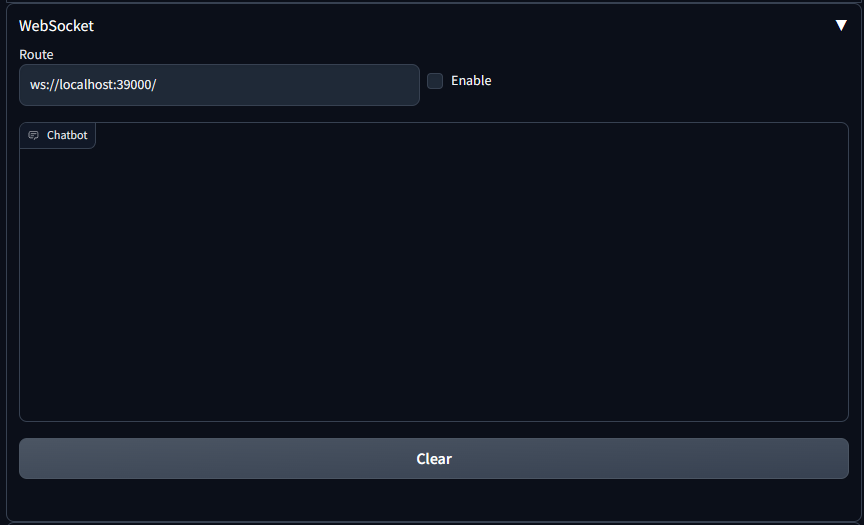
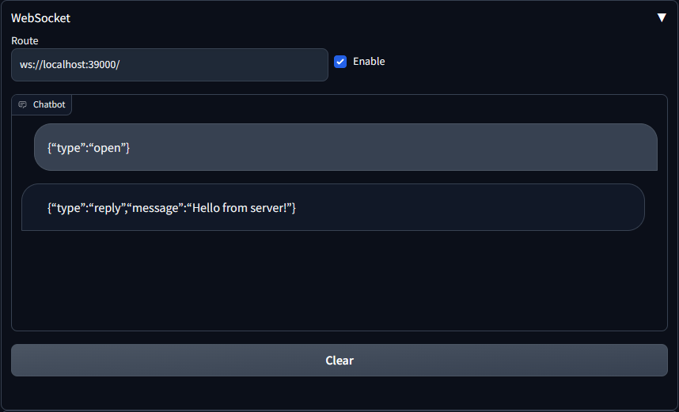
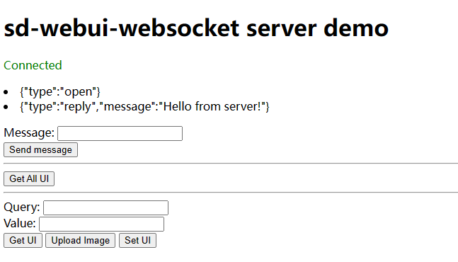

# sd-webui-websocket

This is an extension for [AUTOMATIC1111/stable-diffusion-webui](https://github.com/AUTOMATIC1111/stable-diffusion-webui) which enables communication between an SDWebUI instance and other web pages. This plugin utilizes the WebSocket protocol to establish a real-time connection between two endpoints.

**Note:** Before trying this plugin, please ensure that you have reviewed the [official API documentation for SDWebUI](https://github.com/AUTOMATIC1111/stable-diffusion-webui/wiki/API), considering that it is better supported.

**Warning:** Make sure that you trust the WebSocket server you are connecting to.

https://github.com/xyqlx/sd-webui-websocket/assets/40012783/a99087ed-617d-4aa3-ab32-34d8df2330d8

## Installation

Copy the link to this repository into `Install from URL`:
```
https://github.com/xyqlx/sd-webui-websocket
```
Also you may clone/download this repository and put it to `stable-diffusion-webui/extensions` directory.

## Usage

You will see a section titled `Websocket` on txt2img tab, which looks like this:



Before click on `Enable` checkbox, you should setup a WebSocket server and specify its address in `Route` field.

An example of a WebSocket server can be found in `demo` directory. It is a simple Node.js script that provides HTTP services and websocket services. You can run it with the following command:

```bash
# on first run, after installing node.js
npm install

# default port is 39000, which can be set in demo.js
node demo.js
```

After the server is started, you can specify its address in `Route` field and click on `Enable` checkbox. If everything is correct, you will see a message in the console:



All messages sent or received by sd-webui-websocket plugin will be displayed in the `Chatbot` box. Some messages are truncated since they are too long.

Now you can open `http://localhost:39000` or other address in your browser. You will see a page like this:



Here is a brief description of the function of each button:

- `Send Message`: Send a message to sd-webui-websocket plugin. The message will be displayed in the console of sd-webui-websocket plugin.
- `Get All UI`: Get all UI elements of SDWebUI.
- `Get UI`: Get the UI element specified by the `Query` field. Using querySelector to find the element.
- `Upload Image`: Upload an image to `Value` field.
- `Set UI`: Set the value of the UI element specified by the `Query` field.

This is implemented by sending a JSON message to sd-webui-websocket plugin. The format of the messages are as follows:

```json
[
    {
        // response message has the same id as this
        "id": 0,
        "type": "get_all_ui"
    },
    {
        "id": 5,
        "type": "get_ui",
        "query": "#html-element-id input"
    },
    {
        "id": 12,
        "type": "set_ui",
        "query": "#html-element-id input",
        "value": "string or number or file base64"
    }
]
```

Successful response to these messages:

```json
[
    {
        "id": 0,
        "type": "response_get_all_ui",
        "status": "success",
        "currentTab": "txt2img",
        "elements": [
            {
                "tab": "tab_txt2img",
                "id": "closest ancesotr id",
                "ancestorIds": [
                    "components-2194",
                    "tabs",
                    "..."
                ],
                "type": "textarea, button, file, etc.",
                "value": "input's value or button's text content"
            }
        ]
    },
    {
        "id": 5,
        "type": "response_get_ui",
        "status": "success",
        "element": {
            "type": "textarea, button, file, etc.",
            "value": "input's value or button's text content"
        }
    },
    {
        "id": 12,
        "type": "response_set_ui",
        "status": "success",
    }
]
```

**Note:** Although I don't know why, sometimes if the Stable Diffusion webui is not in the foreground, it won't trigger a reply.

In addition, sd-web-websocket will send messages to the WebSocket server when the following events occur:

```json
[
    {
        "type": "process",
        "p": {
            "outpath_samples": "",
            "outpath_grids": "",
            "prompt": "",
            "prompt_for_display": null,
            "negative_prompt": "",
            "other attribution of StableDiffusionProcessing": "..."
        }
    },
    {
        "type": "before_process_batch",
        "batch_number": 0,
        "prompts": [],
        "seeds": [],
        "subseeds": []
    },
    {
        "type": "process_batch",
        "batch_number": 0,
        "prompts": [],
        "seeds": [],
        "subseeds": []
    },
    {
        "type": "postprocess_batch",
        "batch_number": 0
    },
    {
        "type": "postprocess_image",
        "pp": {
            "image": "base64code",
        }
    },
    {
        "type": "postprocess",
        "processed": {
            "images": ["base64code"],
            "prompt": "",
            "batch_size": 1,
            "info": "",
            "width": 512,
            "sampler_name": "Euler a",
            "steps": 20,
            "other attribution of Processed": "..."
        }
    }
]
```

## Examples

### Set txt2img parameters and generate

```json
[
    { "id": 0, "type": "set_ui", "query": "#txt2img_prompt textarea", "value": "a cat playing with a hat" },
    { "id": 0, "type": "response_set_ui", "status": "success" },
    { "id": 1, "type": "set_ui", "query": "#txt2img_neg_prompt textarea", "value": "blurred" },
    { "id": 1, "type": "response_set_ui", "status": "success" },
    { "id": 2, "type": "set_ui", "query": "#txt2img_sampling input", "value": "DPM++ SDE Karras" },
    { "id": 2, "type": "response_set_ui", "status": "success" },
    { "id": 3, "type": "set_ui", "query": "#txt2img_steps input", "value": "30" },
    { "id": 3, "type": "response_set_ui", "status": "success" },
    { "id": 4, "type": "set_ui", "query": "#txt2img_height input", "value": "720" },
    { "id": 4, "type": "response_set_ui", "status": "success" },
    { "id": 5, "type": "set_ui", "query": "#txt2img_generate", "value": "" },
    { "id": 5, "type": "response_set_ui", "status": "success" },
    { "type": "process", "p": { "...": "..."} },
    { "type": "before_process_batch", "...": "..." },
    { "type": "process_batch", "...": "..." },
    { "type": "postprocess_batch", "batch_number": 0},
    { "type": "postprocess_image", "pp": { "image": ""} },
    { "type": "postprocess", "processed" : { "...": "..." } }
]
```

### Set img2img inpainting image and mask

```json
[
    { "id": 0, "type": "set_ui", "query": "#tabs button:nth-child(2)", "value": "" },
    { "id": 0, "type": "response_set_ui", "status": "success" },
    { "id": 1, "type": "set_ui", "query": "#mode_img2img button:nth-child(5)", "value": "" },
    { "id": 1, "type": "response_set_ui", "status": "success" },
    { "id": 2, "type": "set_ui", "query": "#img_inpaint_base input", "value": "data:image/jpeg;base64,..." },
    { "id": 2, "type": "response_set_ui", "status": "success" },
    { "id": 3, "type": "set_ui", "query": "#img_inpaint_mask input", "value": "data:image/jpeg;base64,..." },
    { "id": 3, "type": "response_set_ui", "status": "success" }
]
```

### ControlNet

```json
{"query":"#txt2img_controlnet_ControlNet_controlnet_enable_checkbox input","value":"true","type":"set_ui","id":0}
{"id":0,"type":"response_set_ui","status":"success"}
{"id": 1, "query":"#txt2img_controlnet_ControlNet_input_image input","value":"data:image/jpeg;base64,..."}
{"id":1,"type":"response_set_ui","status":"success"}
{"query":"#txt2img_controlnet_ControlNet_controlnet_preprocessor_dropdown input","value":"tile_colorfix","type":"set_ui","id":2}
{"id":2,"type":"response_set_ui","status":"success"}
{"query":"#txt2img_controlnet_ControlNet_controlnet_model_dropdown input","value":"control_v11f1e_sd15_tile [a371b31b]","type":"set_ui","id":3}
{"id":3,"type":"response_set_ui","status":"success"}
```

## Debug

### Show hidden elements

comment out the following code in `style.css`:

```css
display: none
```

### How this extension works

1. `scripts/websocket.py` create gradio UI and monitor events for Stable Diffusion WebUI.
2. `javascript/sd-webui-websocket.js` send messages to WebSocket server and get or set UI elements of Stable Diffusion WebUI.
